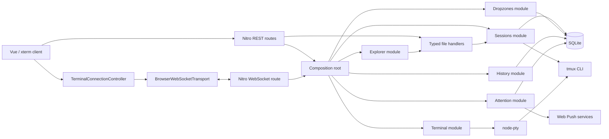
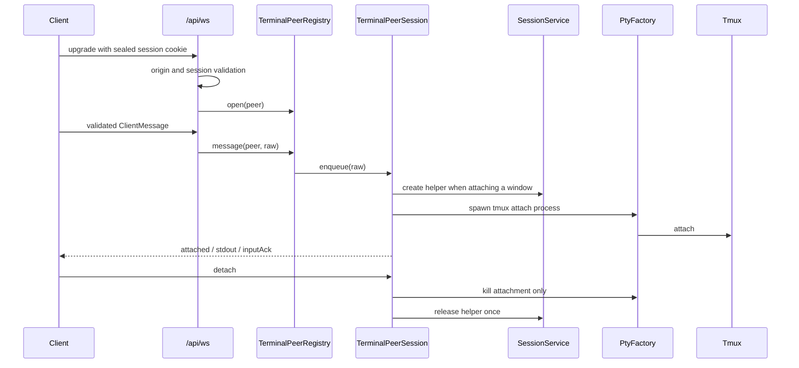

# Bitveins architecture and engineering guide

Bitveins is an async-first terminal interface built with Nuxt 4, Vue 3,
Nitro WebSockets, xterm.js, `node-pty`, tmux, Drizzle and SQLite.

## System overview



REST and WebSocket delivery code does not construct concrete adapters directly.
`server/composition/bitveins-container.ts` is the single production composition
root. It wires application services to concrete adapters and exposes dropzone,
session, history and terminal-peer operations. Stateless file delivery handlers
receive their filesystem and response collaborators through typed factories.

## Server modules

Server code is grouped first by functional module and then, where useful, by
layer:

```text
server/
  composition/
  modules/
    dropzones/
      application/
      model/
      ports/
      adapters/
    files/
      delivery/
    explorer/
      application/
      delivery/
      model/
      ports/
      adapters/
    history/
      application/
      model/
      ports/
      adapters/
    sessions/
      application/
      delivery/
      model/
      ports/
      adapters/
        tmux/
    terminal/
      application/
      ports/
      adapters/
    attention/
      application/
      model/
      ports/
      adapters/
      delivery/
```

The `sessions` module owns session and window orchestration. Its application
service depends on narrow ports for tmux, persistence and path inspection.
`TmuxCliAdapter`, `SqliteSessionRepository` and the Node filesystem adapters are
replaceable implementations of those ports.

The `history` module owns async command-history validation and persistence.
`HistoryService` depends only on `HistoryRepository`;
`DrizzleHistoryRepository` is the sole module that knows the history schema and
Drizzle query API.

The `dropzones` module owns the saved workspace shortcuts.
`DropzoneService` depends on `DropzoneRepository`; the Drizzle adapter replaces
the complete ordered collection in one transaction and rolls back on failure.

The `files` module contains typed delivery-handler factories for upload and
download. They isolate H3 routes from filesystem, stream and archive behavior
without introducing stateful classes for stateless request mapping. The
sessions delivery layer applies the same pattern to the legacy window-rename
route.

The `explorer` module owns workspace-document classification, raster streaming
and terminal-reference resolution. `WorkspaceDocumentService` and
`FileReferenceResolver` depend on repository and locator ports. Their Node
adapters canonicalize every target inside the session root, sniff raster magic
bytes, bound project discovery by depth, directory count, wall time,
concurrency and result count, and deduplicate results by canonical path. The
composition root owns these adapters and their short-lived root-discovery
cache; routes only validate transport data and invoke application services.

Browser documents use a discriminated text/image union. Terminal path parsing
is pure, while `TerminalFileLinkProvider` owns the xterm provider, modifier
listeners and disposal lifecycle. Browser root preferences are isolated behind
a typed repository and keyed by stable `session + tmux window ID`.

Mobile Live input deliberately separates terminal interaction from virtual
keyboard ownership. Xterm's helper textarea uses `inputmode="none"` on mobile,
so taps and long-press selection cannot summon the OS keyboard. A dedicated
native input is focused only by the explicit Keyboard toggle; Live modifiers
alter the next emitted terminal sequence without acquiring focus themselves.
The selection controller publishes the selected text itself as reactive state,
so file actions follow every incremental xterm selection update rather than a
stale boolean snapshot. Selection parsing also evaluates a whitespace-free
candidate before the literal selection and resolves every candidate in order,
which reconstructs paths that terminal UIs hard-wrap across display rows
without losing the safe fallback for genuine multi-line selections.

Async editor state belongs to the active `session + tmux window ID + index`
scope. Changing scope clears the editor and history cursor. Only the last
submitted command is persisted, and it is restored exclusively through the
explicit recovery action; unsent drafts are never hydrated into another tmux
conversation. Window creation selects its returned index before attaching the
terminal so the UI scope and PTY attachment change atomically from the user's
perspective.

The `terminal` module owns one WebSocket peer's PTY lifecycle.
`TerminalPeerSession` serializes messages and releases PTYs and helper sessions
idempotently. Disposal joins the same serialized queue, so an attachment that
finishes after peer closure is still released. `TerminalPeerRegistry` owns the
active peers, heartbeats and the set of active helpers. Only `NodePtyFactory`
imports `node-pty`; `TmuxTerminalAttachmentProcessFactory` translates semantic
attachments into PTY spawn arguments and propagates the configured tmux socket.

The `attention` module owns Agent Inbox events, Web Push subscriptions and the
notification privacy preference. `AttentionService` persists an event before
publishing it to active WebSocket peers and queues Push delivery independently;
provider failures cannot fail event creation. `WebPushNotificationService`
bounds subscription concurrency, removes endpoints rejected with HTTP 404/410
and logs only redacted status information. SQLite access remains inside the two
Drizzle repositories.

The browser receives typed `attentionEvent` messages on the existing terminal
WebSocket transport. Persistent inbox refresh remains authoritative across
reconnects, so reconnecting never triggers duplicate notifications. Deep links
carry only internal `session`, stable `window` and `event` query parameters.
The client resolves the stable tmux window ID to its current index before
attaching.

The custom inject-manifest Service Worker handles `push` and
`notificationclick`. Notification URLs are accepted only when they resolve to
the current Bitveins origin and root route. The worker focuses or opens the PWA;
it cannot execute commands or navigate to arbitrary origins.

Application services depend on ports; the composition root selects their
concrete adapters. Tmux commands are executed with `execFile` argument arrays;
no shell interpolation is used.

## Browser connection lifecycle

`TerminalConnectionMachine` is the source of truth for connection phase:

```text
detached -> connecting -> attaching -> attached
                ^              |
                |              v
           reconnecting <- transport failure

any active phase -> offline -> connecting
any phase -> disposed
```

The machine has no browser, Vue, xterm, WebSocket or timer dependency. It
accepts typed events and emits typed effects. Transport generation identifiers
ensure that late events from a replaced socket cannot mutate the current
connection.

`TerminalConnectionController` owns the machine, current transport, scheduler,
watchdog and environment subscription. It executes machine effects and exposes
an imperative API to `useTerminalSocket`. The composable remains a Vue/xterm
adapter responsible for refs, terminal sizing, focus behavior and reliable
input composition.

`BrowserWebSocketTransport` is the only client module that knows the native
`WebSocket` constructor. It parses every incoming message with the shared Zod
contract before forwarding it.

## WebSocket and PTY lifecycle



Messages from a peer are processed in order. A detach kills only the local
attachment PTY and an optional Bitveins helper; it never kills the user's
business tmux session.

## Reliability

- The server emits a heartbeat every 20 seconds.
- The browser checks relevant lifecycle state every 15 seconds.
- A connection is stale after 45 seconds without activity.
- An unanswered probe or attachment attempt times out after 8 seconds.
- Reconnect delays are deterministic and capped at 16 seconds:
  `1s, 2s, 4s, 8s, 16s`.
- Reliable inputs remain in the client outbox until `inputAck`.
- The server deduplicates reliable input identifiers and releases a claim if a
  PTY write fails, allowing a safe retry.
- Window attachments use marked `_bitveins_` helper sessions. Startup and
  periodic cleanup remove only Bitveins-owned helpers.

## Security boundaries

1. The production service binds exclusively to `127.0.0.1`.
2. REST routes and WebSocket upgrades require the same sealed, HTTP-only Nuxt
   Auth Utils session cookie.
3. Auth versioning supports immediate server-side revocation.
4. Browser HTTP and WebSocket requests are restricted by the configured origin
   allowlist.
5. File operations canonicalize paths and reject traversal and symlink escapes.
6. Raster previews require magic-byte allowlisting, regular files, size limits,
   `nosniff` and private no-store responses; SVG is excluded.
7. Project-root discovery is confined, bounded and ambiguity-preserving.
8. Tmux names and indices are normalized before reaching the CLI adapter.
9. Login attempts are protected by a bounded-window rate limiter.

## Testing strategy

The test tree mirrors the source tree. Pure model tests, application-service
tests and controller tests use in-memory collaborators without module mocks.
Concrete tmux behavior is validated separately on a dedicated tmux socket, so
the user's tmux server cannot be touched.

The authenticated E2E owns a unique loopback port, SQLite database, workspace
and tmux socket for each Playwright run. It performs login, create, rename,
WebSocket/PTY attach, Explorer image preview, modifier-hover file navigation,
ambiguous-root selection, preference removal, detach and delete against the
production build. Global teardown stops the isolated server before deleting its
resources; repeated runs therefore leave no socket, process, workspace or
database behind.

## Client bundle and build warnings

The locked authentication shell is the only eagerly loaded application view.
The terminal application, xterm pane and CodeMirror editor are asynchronous
boundaries. CodeMirror language support is imported per file type, preventing
all language parsers from joining one editor chunk.

`build/build-warning-policy.ts` contains a narrow, tested allowlist for known
upstream sourcemap and annotation warnings. Both client and SSR Vite builds use
the same policy. Unknown warnings still reach Rollup's reporter, so dependency
updates cannot silently add new warning classes.

The required quality gates are:

```bash
pnpm typecheck
pnpm lint
pnpm test:coverage
pnpm build
pnpm test:e2e
```

CI also installs tmux before running the isolated integration test.

## Native distribution

The product release is a Linux x86_64 archive rather than a source checkout or
container. It contains the CLI, Nitro output, a pinned Node runtime and the
native addons built on the target architecture.

The `bitveins` CLI is organized by responsibility:

- `presentation` owns the command registry, typed argument parsing, help and
  redacted error rendering;
- `application` owns install, update, doctor, password rotation and uninstall
  use cases;
- `core` owns configuration, release metadata, installation paths and stable
  exit-code errors;
- `ports` isolate filesystem, host, health, release, password and service
  capabilities;
- `platform` contains the concrete Linux, filesystem, network, GitHub, systemd
  and terminal adapters, plus their supporting implementation code.

ESLint prevents application code from importing platform adapters. The
composition root is the only place that assembles concrete dependencies.
Installer tests inject these boundaries and use temporary XDG roots; they never
mutate the maintainer's active service.

Installed releases are immutable siblings under
`~/.local/lib/bitveins/releases`. The `current` symlink is the activation
boundary. Installation and update prepare a release before switching that link,
then restart the systemd user service and require HTTP 200 over loopback.
`InstallationSnapshot` captures the previous configuration, unit, symlinks and
activation history. `InstallationTransaction` owns activation and rollback,
including explicit reporting when both the operation and rollback fail.
Activation history records current and previous releases by event rather than
filesystem mtime; pruning retains those two functional releases. Failure
restores the previous config/link and restarts the previous release.

`GitHubReleaseSource` streams separately bounded metadata, checksum,
attestation and archive downloads. HTTPS redirects are followed manually and
cannot downgrade protocols. `ReleaseArchive` is the shared checksum, path,
entry-type, entry-count and extracted-size policy. Sigstore verification binds
the archive to the official repository, release workflow, GitHub-hosted
builder, tag and source commit before extraction. The bootstrap mirrors the
certificate, commit, archive-limit and manifest checks with pinned Cosign and
portable shell utilities.

The packaging scripts run as native TypeScript on the pinned Node runtime.
Build, verification and smoke-test orchestration reuse typed release layout,
license, hashing, archive, ELF and timestamp helpers. A dedicated Vitest
project covers all executable CLI/release logic except the eight-line process
bootstrap, with stricter per-file gates on transactional and trust-critical
code.

The service runs as the tmux-owning Unix user. `KillMode=process` is deliberate:
restarting the Bitveins server must not kill ordinary tmux sessions. The CLI
still cleans up its own PTY attachments through the application lifecycle.
