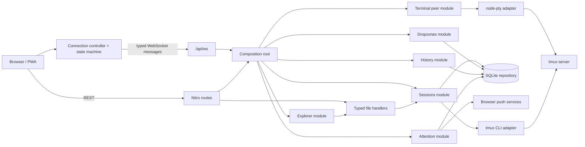

# Bitveins

Async Terminal PWA for managing local `tmux` sessions through Nuxt 4, Nitro
WebSockets, `node-pty`, and xterm.js.

Bitveins is a single-user administrative tool: unlocking it grants the Unix
permissions of the account running the service. It is not a multi-tenant
sandbox.

<p align="center">
  <a href="https://rebasereality.com/bitveins/media/bitveins/overview-desktop.webp">
    
  </a>
  <a href="https://rebasereality.com/bitveins/media/bitveins/hero-mobile-codex.webp">
    
  </a>
</p>

## Modes

- **Async** is the default. Type in the native textarea and send a complete command or multi-line block with Enter. This is best for high-latency mobile links because local editing stays responsive.
- **Live** forwards xterm keystrokes directly to the PTY. Use it for Codex `$` skill menus, `@` file pickers, shells, editors, and other interactive terminal apps.

## Agent Inbox and notifications

Agent Inbox records local attention events from commands, scripts and development
agents. Events can report required input or permission, completion, failure or
general information. When an event names a tmux session and stable window ID,
opening it attaches that exact context and marks the event as read.

Open Settings → Agent Inbox notifications to enable Web Push for the current
device. The permission prompt appears only after selecting **Enable
notifications**. Notifications use a generic title and body by default so lock
screens do not expose event details. The optional detailed mode adds the event
title, project, source and a strictly shortened summary; it is disabled by
default. On iPhone and iPad, install Bitveins on the Home Screen before enabling
notifications.

Create an event from the VPS with the product CLI:

```bash
bitveins event \
  --type permission_required \
  --source local-script \
  --title "Permission required" \
  --summary "Run database migrations?" \
  --project Kouizine
```

Inside tmux, Bitveins detects the session, stable window ID and pane ID from the
current pane. `--session`, `--window` and `--pane` explicitly override detected
values. The command talks only to the loopback Bitveins service with a dedicated
integration token; it never reuses the browser password.

### Codex lifecycle integration

Native Bitveins releases include an optional Codex plugin backed by Codex's
lifecycle hooks. Install it with:

```bash
bitveins codex install
```

Start a new Codex session, open `/hooks`, and trust the Bitveins hook
definition. Codex intentionally requires this review before non-managed plugin
hooks can run and whenever their definition changes.

The plugin emits the lifecycle states Codex exposes reliably: permission
requests and completed parent turns, split by whether a local tool hook was
observed. Codex does not currently expose distinct clarification-request or
failed-turn hooks, so Bitveins does not guess those states from prompts,
responses, or transcripts. Hosted tools outside the local function-tool hook
path may not be counted as tool use. Text-only completion notifications remain
opt-in under Settings -> Notifications.

Delivery is fail-open and loopback-only. The plugin sends only a fixed typed
lifecycle signal plus validated tmux window and pane IDs. It never sends
prompts, responses, commands, tool inputs or outputs, model names, transcript
paths, working directories, endpoints, or tokens. See
[`integrations/codex-notifications/plugins/bitveins-notifications/README.md`](integrations/codex-notifications/plugins/bitveins-notifications/README.md)
for the exact hook mapping and privacy boundaries.

### Hermes lifecycle integration

Native Bitveins releases include an optional Hermes Agent plugin. Install and
enable it for the active Hermes profile with:

```bash
bitveins hermes install
hermes gateway restart
```

This targets the `default` Hermes profile. For another existing profile, use
`bitveins hermes install --profile <name>` and restart that profile with
`hermes --profile <name> gateway restart`. Open a new Hermes CLI session after
installation. The plugin sends typed lifecycle signals when Hermes requires
input or permission, completes a parent turn, or fails without a deliberate
interruption. Settings controls which signals create Agent Inbox events and
Web Push notifications. The existing mapping remains enabled by default;
text-only parent responses are available as an opt-in. Smart-mode approvals,
deliberate interruptions and delegated child completions remain silent.

Delivery is fail-open and loopback-only. The plugin never includes prompts,
responses, commands, tool arguments, endpoints, tokens, the current working
path or its project basename. Set `BITVEINS_NOTIFICATIONS=0` for a Hermes
process to disable delivery from that process. See
[`integrations/hermes-notifications/README.md`](integrations/hermes-notifications/README.md)
for hook mappings and verification details.

## Explorer and terminal file links

Explorer opens text files and authenticated raster previews directly from the
selected session workspace. Images remain in their project: Bitveins does not
copy them to `public/` or rebuild itself to display them.

Paths printed in xterm become discoverable without changing ordinary terminal
mouse behavior:

- hold `Ctrl` on Linux/Windows or `Cmd` on macOS to reveal an available path;
- click while holding that modifier to open the file in Explorer;
- when the same relative path exists in several nested projects, choose its
  root explicitly;
- optionally remember that root for the current tmux window, or change, forget
  or clear remembered roots from the `Path links` menu;
- on touch devices, long-press and drag to select a path, then use
  `Open in Explorer`; paths split across terminal display lines are
  reconstructed before resolution, and tapping the terminal never summons the
  virtual keyboard.

On mobile in Live mode, the virtual keyboard is explicit. Use the keyboard
icon immediately after `Reorder` to open or close Gboard (or its equivalent).
Terminal taps, text selection, modifiers and one-tap terminal controls never
open it implicitly; modifiers and terminal controls preserve it when it is
already open.

The mobile Async drawer starts empty for every tmux window. Bitveins never
silently restores an old draft into a different conversation; the last sent
command remains available only through the explicit restore action.

Supported previews are PNG, JPEG, GIF, WebP and AVIF up to 50 MiB. SVG and
other active formats are never rendered as images. Text files open at the
reported `:line[:column]` when present.

## Supported platform

- Linux x86_64 with kernel 4.18+ and glibc 2.34+
- systemd with user services
- `tmux` 3.1 or newer

The native release includes its own Node runtime and compiled modules. End
users do not need Node, pnpm, Git or native build tooling.

## Native installation

Download and inspect the bootstrap, then run it as the Unix user who owns the
tmux sessions:

```bash
curl -fsSLO https://github.com/rebasereality/bitveins/releases/latest/download/install.sh
less install.sh
sh install.sh
```

The installer downloads versioned release assets over HTTPS, verifies their
SHA-256 checksum and Sigstore build provenance, asks for a Bitveins password
twice without echoing it, creates the session secret, installs a systemd user
service and checks `http://127.0.0.1:3000/api/auth/session`. If Cosign is not
already installed, the bootstrap downloads one pinned Cosign build and verifies
its digest before use. A missing or invalid provenance bundle stops the
installation; the checksum is never treated as proof of origin.

For a version-pinned or fully manual installation, see
[`docs/installation.md`](docs/installation.md).

Bitveins deliberately refuses:

- installation as `root`;
- an empty or weak password;
- production startup without authentication secrets;
- a production bind other than `127.0.0.1`.

The local UI is then available at `http://127.0.0.1:3000`. Put an authenticated
TLS tunnel or reverse proxy in front of that loopback listener before using it
remotely.

## Product CLI

```bash
bitveins help
bitveins install --help
bitveins start
bitveins stop
bitveins status
bitveins doctor
bitveins event --type completed --source shell --title "Command completed"
bitveins codex install
bitveins hermes install
bitveins logs --follow
bitveins restart
bitveins password
bitveins update
bitveins uninstall
bitveins version
```

`bitveins password` rotates the Scrypt hash and revokes existing browser
sessions. `bitveins uninstall` preserves configuration and history by default;
`bitveins uninstall --purge` requires an additional interactive confirmation.
Every command supports `bitveins <command> --help`. Expected failures are
concise; append `--verbose` to include redacted diagnostic causes.

A generic shell integration can preserve the original exit status:

```bash
long-running-command
status=$?

if [ "$status" -eq 0 ]; then
  bitveins event --type completed --source shell --title "Command completed"
else
  bitveins event \
    --type failed \
    --source shell \
    --title "Command failed" \
    --summary "Exit code: $status"
fi

exit "$status"
```

CLI exit codes are stable:

| Code | Meaning |
| ---: | --- |
| 0 | success |
| 1 | unexpected operation or transaction failure |
| 2 | invalid command or arguments |
| 3 | `doctor` found an unhealthy installation |
| 4 | missing prerequisite, invalid configuration or unavailable service |
| 5 | release integrity or provenance failure |

The default installation uses:

```text
~/.local/bin/bitveins
~/.local/lib/bitveins/
~/.config/bitveins/env
~/.config/systemd/user/bitveins.service
~/.local/share/bitveins/history.sqlite
```

To keep the user service running after logout, enable systemd lingering:

```bash
sudo loginctl enable-linger "$USER"
```

This optional command is intentionally not executed silently by the installer.

## Development

The source checkout and pnpm commands are contributor tools, not the public
installation path. See [`CONTRIBUTING.md`](CONTRIBUTING.md) for local setup and
quality gates.

## System Architecture



The server is organized by functional module under `server/modules/`.
Application services depend on narrow ports; concrete tmux, SQLite and PTY
adapters are wired in `server/composition/`, while stateless file routes use
typed handler factories. See [`ARCHITECTURE.md`](ARCHITECTURE.md) for lifecycle,
test-isolation and dependency details.

## API Surface

- `GET /api/sessions` lists tmux sessions.
- `POST /api/sessions` creates a detached tmux session with `{ "name": string, "path": string }`.
- `DELETE /api/sessions/:name` kills a tmux session.
- `GET /api/sessions/:name/history` lists saved async input messages for a tmux session, newest first.
- `POST /api/sessions/:name/history` saves `{ "message": string }` to that session's async input history.
- `GET /api/sessions/:name/files/metadata` classifies a confined workspace document.
- `GET /api/sessions/:name/files/image` streams a confined, allowlisted raster image.
- `POST /api/sessions/:name/files/resolve` resolves a bounded batch of terminal file references.
- `GET /api/sessions/:name/files/roots` lists bounded project-root choices.
- `POST /api/auth/login` unlocks the app with `{ "password": string }`.
- `POST /api/auth/logout` clears the sealed session.
- `GET /api/auth/session` reports whether the browser is unlocked.
- `GET /api/attention` lists persistent Agent Inbox events.
- `POST /api/attention` creates an authenticated event.
- `PATCH /api/attention/:id` marks an event read or dismissed.
- `/api/attention/push/*` manages the current device subscription and privacy preference.
- `WS /api/ws` uses the sealed session cookie and accepts terminal attach, live input, reliable async input, resize, heartbeat, and detach actions. Reliable async inputs are acknowledged and deduplicated across reconnects.

Detach only kills the local `tmux attach-session` PTY process. It leaves the underlying tmux session alive.
